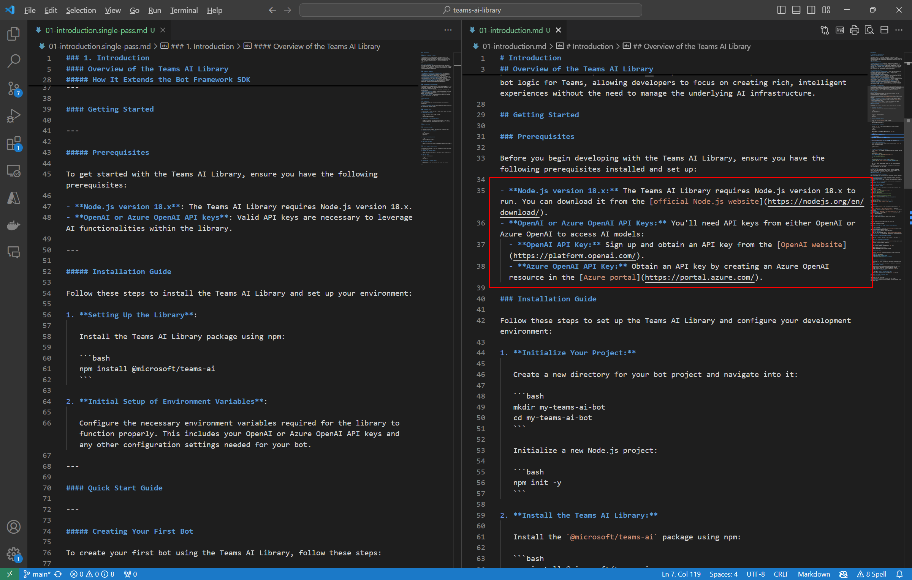
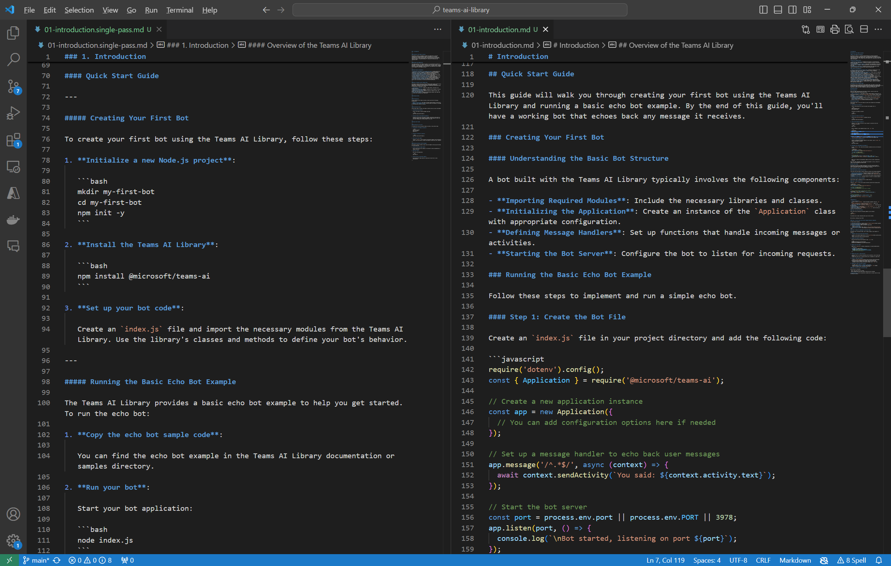

# Creating Software Documentation

This project demonstrates using Awareness to create detailed software software documentation. In this case we've created documentation for the JavaScript version of the [Microsoft Teams AI Library](https://github.com/microsoft/teams-ai). The bulk of the documentation was generated by reasoning over the source code in the main [teams-ai package](https://github.com/microsoft/teams-ai/tree/main/js/packages/teams-ai) and a subset of the [samples](https://github.com/microsoft/teams-ai/tree/main/js/samples), 278 documents totalling ~280,000 tokens in size. All of the documentation was generated using a mix of Large Language Models; `o1-preview`, `gpt-4o`, and `gpt-4o-mini`. None of the documentation has been edited so everything is 100% generated content. The goal of document generation is to give you a great start so as with anything that's AI generated you'll want to review the content closely. I'll point out some key areas where human intervention can improve the generated output. 

The quality and accuracy of the documentation Awareness generates is unprecedented thanks to the multiple grounding passes Awareness makes over the source corpus.  The 9 output documents generated for this project total 45,164 tokens or 32,131 words and 179 pages of text.  At this level of complexity a good technical writer could write about 1,000 words a day so it would have taken a human a month to generate what Awareness generated in a few hours. Awareness needed to process around 26 million tokens for a cost of $130. The output quality is all `o1-preview` quality output but we're leveraging our hybrid model that blends `o1-preview` with `gpt-4o-mini` to help reduce costs and improve overall throughput. If you were to just use `o1-preview` to generate these 9 documents they would have totalled around 19,000 tokens in length and you wouldn't have been able to properly ground the documents because it would have been impossible to fit all 280k tokens into the 128k token context window of `o1-preview`. Awareness creates documents in an agentic loop that lets it write documents 4 - 5 times longer length wise and the Elastic Context Window (ECW) lets it ground those documents in a corpus of any size. The 280,000 tokens of the Teams AI Library is actually a rather small corpus for Awareness. If you were to run the same project in Awareness using `o1-preview` without the hybrid model it would have cost $440 to generate and taken over a day to run and the quality of the generated documentation would have been nearly identical.

## Information Architecture and Grounding

Documentation generation starts by creating an [Information Architecture](./00-information-architecture.md) document. This describes the shape of the overall documentation set we're going to generate. We used Awareness with `o1-preview` to make a single pass against the corpus. For this corpus of 278 documents, we end up making 284 model calls and generating around 70k intermediate thinking tokens which are over an above the thinking tokens o1-preview generates. The bulk of these requests are actually made against `gpt-4o-mini` which is how we're able to both reduce costs and dramatically increase the overall request throughput. We use gpt-4o-mini for screening the content during the grounding phase of writing the document as it's a task that it's well suited for. All of the core reasoning is done by o1-preview which results in longer and more well thought out output. For this particular project we took the IA generated by Awareness as is but this is the first point where you'd want a human editor to review the models output. Any mistakes at this level will just magnify downstream so it's important to make sure you have a solid IA in place before moving on.

Once we have our IA in place we can start the task of flushing it out. We chose to generate each section of the IA as a separate document but you might decide to just make them separate sections in a single document depending on the project. Here's the list of sections we generated:

1. [Introduction](./01-introduction.md)
2. [Core Concepts](./02-core-concepts.md)
3. [Modules and API Reference](./03-modules-and-api.md)
4. [Tutorials and Samples](./04-tutorials-and-samples.md)
5. [Advanced Topics](./05-advanced-topics.md)
6. [Deployment and Operations](./06-deployment-and-operations.md)
7. [FAQs and Troubleshooting](./07-faqs-and-troubleshooting.md)
8. [Contributing and Community](./08-contributing-and-community.md)
9. [Glossary](./09-glossary.md)

The first 3 sections were all grounded using the package source and a subset of samples totally 280k tokens. The 4th section was grounded using just the samples but it was the full set of samples totalling 135k tokens. The only reason not to include the full set of samples in the base corpus is that the additional samples didn't add any material value. Awareness wasn't going to learn anything new from them.

For the 5th section we switched back to using the base corpus but the information needed for the 6th, 7th, and 8th section isn't in the source code so we switched to using the web for grounding. Awareness can use virtually any source for grounding including Bing powered web search.

The 9th section actually called for an API Reference which would be directly generated from the code so there's no need to show that in this project. What we did generate is a Glossary of definitions and terms by grounding the glossary against the previous 8 generated chapters totalling 43k tokens.

## Document Generation

Writing documentation, like so many tasks in AI, is largely a compression task. You are compressing the information in a corpus, in this case a code base, down to a smaller more densely packed representations of the concepts and behaviors that corpus represents. There's often a translation or pivot that occurs during that compression task which is why we don't think of it as a compression task but at its core it is largely just a compression that's happening. One of the things that we've figured out at Awarity is that the slower you can perform this compression the better the quality of the results. Models like OpenAI's o1 family of models are starting to popularize this concept of "thinking" which we've been doing in Awareness for a while now. 

To generate longer and better quality documents we let Awareness spend some time "thinking" about a document before it writes it. This thinking translates to Awareness running a series of queries over the corpus its grounded in where it records its thoughts. You can see a some examples of these thought traces [here](/02-core-concepts.thoughts.md) and [here](./03-modules-and-api.thoughts.md) and if they look like disorganized ramblings they kind of are but they create a way for the model to organize its thoughts before performing the task we want it to perform. You can think of it as being very similar to the inner dialogue you have with yourself as you're working through a complex problem.

For a comparison we've provided a [single-pass version](./01-introduction.single-pass.md) of the introduction section to compare to the [multi-pass version](./01-introduction.md) where we've let the Awareness think first. The single-pass version is only 849 tokens long compared to the multi-pass version which is 2,156 tokens long. More important then the length difference is the content difference. In the mult-pass version we let Awareness not only think about the local corpus but also the web and we can see that it found some links to download the perquisites needed for the library:

The more significant difference shows up when comparing the Quick Start Guides that were generated for each document. In the single-pass version the Quick Start Guide provides a couple of bash commands but then simply says to go copy the code from the echo bot sample. Not a great Quick Start Guide:

The Quick Start Guide in the multi-pass version walks the developer through writing actual code and while it's not perfect, there are few things it left out that it should have probably included, it's a significant improvement over the single-pass version and much closer to what you want to see in a Quick Start Guide.

## Areas for Improvement

We took all of the outputs AS-IS from Awareness for this project. We didn't modify a single output so we basically let it write anything it wanted to with very little guidance. And given that each document is generated in isolation that means you'll see some variance structure wise across all of the generated documents. Awareness lets you pass in an output template to help control the shape of the output it returns. We didn't do that... Simply providing a common template describing the desired structure of the documents should address a lot of the consistency issues. 

As stated earlier, there are a few key points during the generation where you want a human to closely review the output of Awareness for the best initial results.  The first point is immediately after the IA is generated and the second point is after the document outline is generated during document generation. Document generation can be broken up into 3 phases; "thinking", "outlining", and "writing". After Awareness thinks about the document it wants to create it then drafts an outline of the document it wants to write and then finally it uses its thoughts to fill in the outline. You can see an example of a generated outline [here](./07-faqs-and-troubleshooting.outline.md). Having a human review and edit the generated outline will result in a better final document with less overlapping concepts. 
